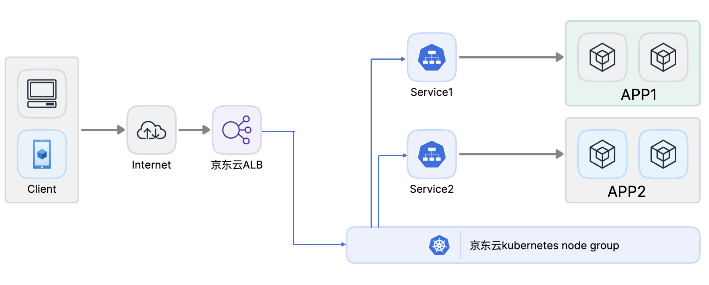

## 项目简介： 

```
1.将基于go语言开发的项目进行代码编译、构建成容器镜像并上传到京东云镜像仓库、部署到京东云kubernetes环境, 并实现基于ALB在公网访问

2.在京东云云主机部署jenkins，用于实现kubernetes环境中的APP代码部署和回滚

3.编写脚本、基于jenkins实现go语言代码部署和回滚
```


## 项目效果:



## 操作文档:

[1.将基于go语言开发的项目进行代码编译、构建成容器镜像并上传到京东云镜像仓库、部署到京东云kubernetes环境, 并实现基于ALB在公网访问](https://github.com/zhangshijle/hello-world/blob/main/docs/1.%E5%B0%86go%E6%9C%8D%E5%8A%A1%E8%BF%9B%E8%A1%8C%E4%BB%A3%E7%A0%81%E7%BC%96%E8%AF%91%E5%B9%B6%E9%83%A8%E7%BD%B2%E5%88%B0%E4%BA%AC%E4%B8%9C%E4%BA%91kubernetes/%E5%B0%86go%E6%9C%8D%E5%8A%A1%E9%83%A8%E7%BD%B2%E5%88%B0%E4%BA%AC%E4%B8%9C%E4%BA%91K8S.md)

[2.在京东云云主机部署jenkins，用于实现kubernetes环境中的APP代码部署和回滚](https://github.com/zhangshijle/hello-world/blob/main/docs/2.%E4%BA%AC%E4%B8%9C%E4%BA%91%E9%83%A8%E7%BD%B2%E9%83%A8%E7%BD%B2jenkins/%E4%BA%AC%E4%B8%9C%E4%BA%91%E9%83%A8%E7%BD%B2%E9%83%A8%E7%BD%B2jenkins.md)

[3.编写脚本、基于jenkins实现go语言代码部署和回滚](https://github.com/zhangshijle/hello-world/blob/main/docs/3.%E5%9F%BA%E4%BA%8Ejenkins%E5%AE%9E%E7%8E%B0go%E8%AF%AD%E8%A8%80%E4%BB%A3%E7%A0%81%E9%83%A8%E7%BD%B2%E5%92%8C%E5%9B%9E%E6%BB%9A/%E5%9F%BA%E4%BA%8Ejenkins%E5%AE%9E%E7%8E%B0go%E8%AF%AD%E8%A8%80%E4%BB%A3%E7%A0%81%E9%83%A8%E7%BD%B2%E5%92%8C%E5%9B%9E%E6%BB%9A.md)
