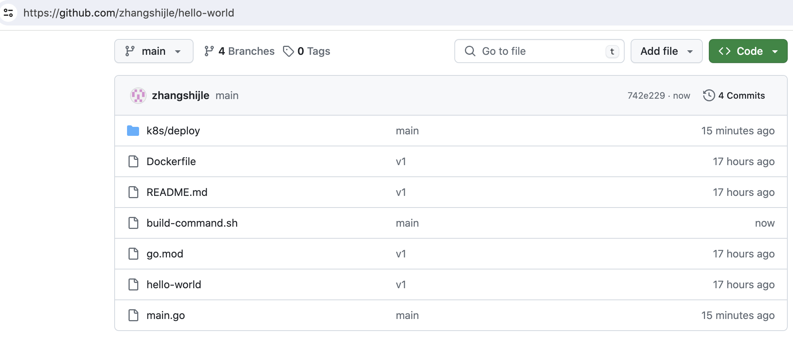
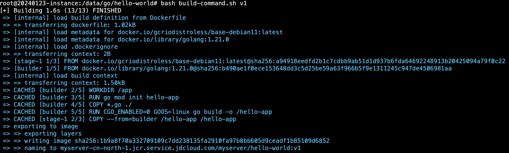
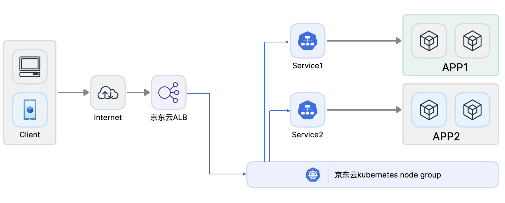
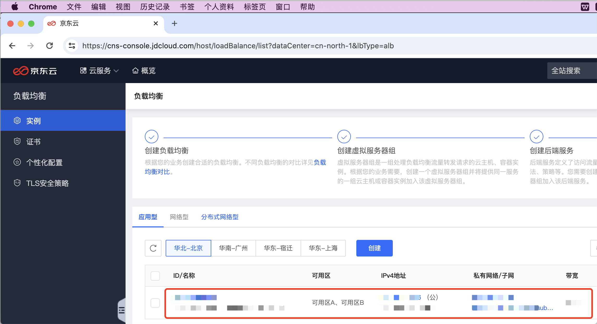
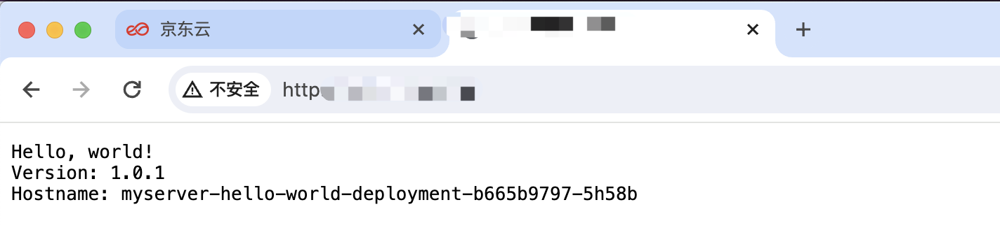

将go服务部署到京东云K8S

# 一：go源代码及编译：

github 地址：https://github.com/zhangshijle/hello-world/



## 1.1：clone 项目源码：

```bash
root@20240123-instance:/data# mkdir -p  /data/go/
root@20240123-instance:/data# cd /data/go/
root@20240123-instance:/data/go# git clone https://github.com/zhangshijle/hello-world.git
Cloning into 'hello-world'...
remote: Enumerating objects: 50, done.
remote: Counting objects: 100% (50/50), done.
remote: Compressing objects: 100% (31/31), done.
remote: Total 50 (delta 22), reused 37 (delta 12), pack-reused 0
Receiving objects: 100% (50/50), 3.38 MiB | 896.00 KiB/s, done.
Resolving deltas: 100% (22/22), done.

root@20240123-instance:/data/go# cd hello-world/
total 6176
drwxr-xr-x 4 root root    4096 Mar 28 11:26 ./
drwxr-xr-x 3 root root    4096 Mar 28 11:26 ../
-rw-r--r-- 1 root root     204 Mar 28 11:30 build-command.sh #容器镜像构建脚本
-rw-r--r-- 1 root root     982 Mar 28 11:26 Dockerfile #构建容器进行的dockerfile文件
drwxr-xr-x 8 root root    4096 Mar 28 11:26 .git/ #git 客户端配置隐藏目录
-rw-r--r-- 1 root root      28 Mar 28 11:26 go.mod #go依赖模块
-rwxr-xr-x 1 root root 6288864 Mar 28 11:26 hello-world* #编译好的go二进制文件
drwxr-xr-x 3 root root    4096 Mar 28 11:26 k8s/ #kubernetes环境中的deployment和loadbalancer类型的svc文件
-rw-r--r-- 1 root root    1470 Mar 28 11:26 main.go #go代码
-rw-r--r-- 1 root root      14 Mar 28 11:26 README.md #项目描述文件


root@20240123-instance:/data/go/hello-world# git checkout v1 #切换到v1分支
Switched to branch 'v1'
Your branch is up to date with 'origin/v1'.


root@20240123-instance:/data/go/hello-world# git checkout v1
Switched to branch 'v1'
Your branch is up to date with 'origin/v1'.
root@20240123-instance:/data/go/hello-world# cat main.go 
/**
 * Copyright 2021 Google Inc.
 *
 * Licensed under the Apache License, Version 2.0 (the "License");
 * you may not use this file except in compliance with the License.
 * You may obtain a copy of the License at
 *
 *   http://www.apache.org/licenses/LICENSE-2.0
 *
 * Unless required by applicable law or agreed to in writing, software
 * distributed under the License is distributed on an "AS IS" BASIS,
 * WITHOUT WARRANTIES OR CONDITIONS OF ANY KIND, either express or implied.
 * See the License for the specific language governing permissions and
 * limitations under the License.
 */

// [START gke_hello_app]
// [START container_hello_app]
package main

import (
        "fmt"
        "log"
        "net/http"
        "os"
)

func main() {
        // register hello function to handle all requests
        mux := http.NewServeMux()
        mux.HandleFunc("/", hello)

        // use PORT environment variable, or default to 8080
        port := os.Getenv("PORT")
        if port == "" {
                port = "8080"
        }

        // start the web server on port and accept requests
        log.Printf("Server listening on port %s", port)
        log.Fatal(http.ListenAndServe(":"+port, mux))
}

// hello responds to the request with a plain-text "Hello, world" message.
func hello(w http.ResponseWriter, r *http.Request) {
        log.Printf("Serving request: %s", r.URL.Path)
        host, _ := os.Hostname()
        fmt.Fprintf(w, "Hello, world!\n")
        fmt.Fprintf(w, "Version: 1.0.1\n")
        fmt.Fprintf(w, "Hostname: %s\n", host)
}

// [END container_hello_app]
// [END gke_hello_app]
```

## 1.2：容器镜像构建：

基于镜像构建脚本、可以自动传递参数构建镜像并可以将镜像上传到镜像仓库

```bash
root@20240123-instance:/data/go/hello-world# cat build-command.sh  #镜像构建脚本
#!/bin/bash
TAG=$1

docker buildx build -t  myserver-cn-north-1.jcr.service.jdcloud.com/myserver/hello-world:${TAG} .
#docker push myserver-cn-north-1.jcr.service.jdcloud.com/myserver/hello-world:${TAG} #默认注释

root@20240123-instance:/data/go/hello-world# git checkout v1
root@20240123-instance:/data/go/hello-world# bash build-command.sh v1
root@20240123-instance:/data/go/hello-world# docker push myserver-cn-north-1.jcr.service.jdcloud.com/myserver/hello-world:v1
```




## 1.3：在K8S 部署web服务：

```bash
root@20240123-instance:/data/go/hello-world# cat  k8s/deploy/1.hello-world-deployment.yaml 
kind: Deployment
apiVersion: apps/v1
metadata:
  labels:
    app: myserver-hello-world-deployment-label
  name: myserver-hello-world-deployment
  namespace: myserver
spec:
  replicas: 1
  selector:
    matchLabels:
      app: myserver-hello-world-selector
  template:
    metadata:
      labels:
        app: myserver-hello-world-selector
        project: myserver
    spec:
      containers:
      - name: myserver-hello-world-container
        image: myserver-cn-north-1.jcr.service.jdcloud.com/myserver/hello-world:v1 
        imagePullPolicy: IfNotPresent
        #imagePullPolicy: Always
        ports:
        - containerPort: 8080
          protocol: TCP
          name: http
      imagePullSecrets: #指定镜像下载秘钥
      - name: jcr-pull-secret
      
 root@20240123-instance:/data/go/hello-world# kubectl apply  -f  k8s/deploy/1.hello-world-deployment.yaml #部署pod
deployment.apps/myserver-hello-world-deployment created

root@20240123-instance:/data/go/hello-world# kubectl get pod -n myserver #验证pod状态
NAME                                              READY   STATUS    RESTARTS   AGE
myserver-hello-world-deployment-b665b9797-5h58b   1/1     Running   0          33s
```

## 1.4：创建LoadBalancer类型SVC：

基于LoadBalancer类型SVC会自动创建一个新的ALB(默认是ALB), ALB用于基于公网IP暴露运行正在K8S内网的服务



```bash
root@20240123-instance:/data/go/hello-world# cat k8s/deploy/2.hello-world-service.yaml 
kind: Service
apiVersion: v1
metadata:
  namespace: myserver
  name: myserver-hello-world-alb
  labels:
    k8s-app: myserver-hello-world-alb
  annotations: #具体参考: https://docs.jdcloud.com/cn/jcs-for-kubernetes/deploy-service-new
    service.beta.kubernetes.io/jdcloud-load-balancer-spec: |
      version: "v1"
      loadBalancerType: alb #指定LB类型为ALB
      #loadBalancerId: "alb-xxxxxxx" #可以指定ID复用已有的LB
      internal: false #是否内部LB, false为非内部LB会创建公网IP,true不会创建公网IP
      elasticIp:       # 默认创建按配置收费
        bandwidthMbps: 1 # 单位为兆、默认5M带宽，后期修改带宽值要修改yaml文件并重新apply一次，如果在控制台修改带宽等配置、后期会重新以yaml文件还原
      listeners:
        - protocol: "tcp" #指定ALB的监听协议为TCP,listener的协议,alb:Tcp,Http,Https,Tls;nlb:Tcp;dnlb:Tcp
          connectionIdleTimeSeconds: 600
          backend:
            proxyProtocol: false
          healthCheckSpec:       # 健康检查的配置 
            protocol: "tcp"      # 健康检查协议, 【alb、nlb】取值为Http, Tcp【dnlb】取值为Tcp
            port: 31080 #检查端口, 取值范围为[0,65535]，默认为每个后端实例接收负载均衡流量的端(Optional)
            healthyThresholdCount: 3         # 健康阀值，取值范围为[1,5]，默认为3 (Optional)
            unhealthyThresholdCount: 3       # 不健康阀值，取值范围为[1,5], 默认为3 (Optional)
            checkTimeoutSeconds: 3           # 响应超时时间, 取值范围为[2,60]，默认为3s (Optional)
            intervalSeconds: 5               # 健康检查间隔, 范围为[5,300], 默认为5s (Optional)
        #- protocol: "tcp" #第二个监听端口的配置
        #  connectionIdleTimeSeconds: 600
        #  backend:
        #    proxyProtocol: true
spec:
  ports:
    - protocol: TCP
      port: 80 #svc端口、会作为ALB的监听端口
      targetPort: 8080 #svc转发的目的controller中的服务端口
      nodePort: 31080 #node端口,ALB需要将客户的请求转发到此端口
  type: LoadBalancer #指定service类型为LoadBalancer
  selector: #目的pod标签匹配配置
    app: myserver-hello-world-selector
    project: myserver
    
    
root@20240123-instance:/data/go/hello-world# kubectl apply  -f k8s/deploy/2.hello-world-service.yaml #创建loadbalancer类型的service
service/myserver-hello-world-alb created


root@20240123-instance:/data/go/hello-world# kubectl  get svc -n myserver #验证svc状态
NAME                       TYPE           CLUSTER-IP      EXTERNAL-IP                   PORT(S)        AGE
myserver-hello-world-alb   LoadBalancer   10.101.59.231   10.101.48.15,116.198.41.106   80:31080/TCP   105s #116.198.41.106是LB的公网IP
```

## 1.5：验证LB状态：



## 1.6：测试访问：

通过LB的公网IP访问K8S中的服务



