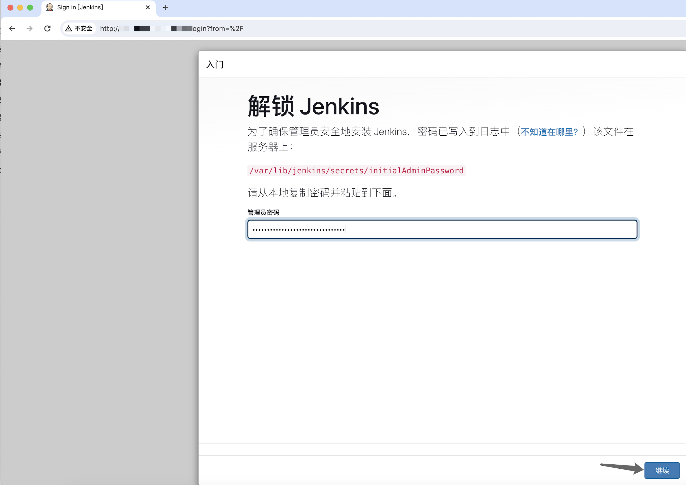
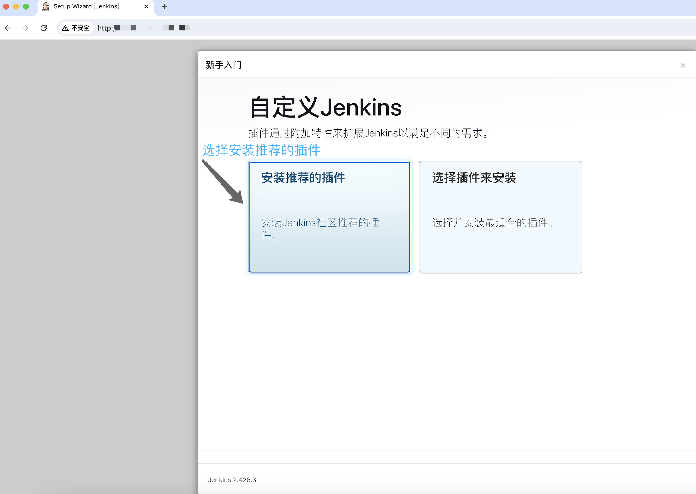
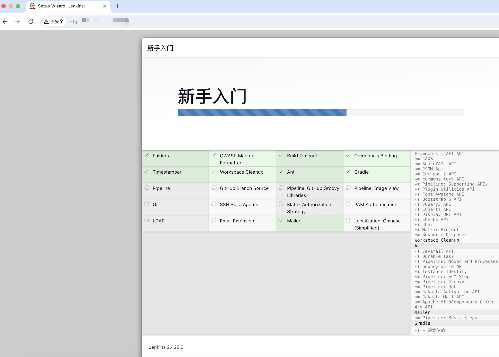
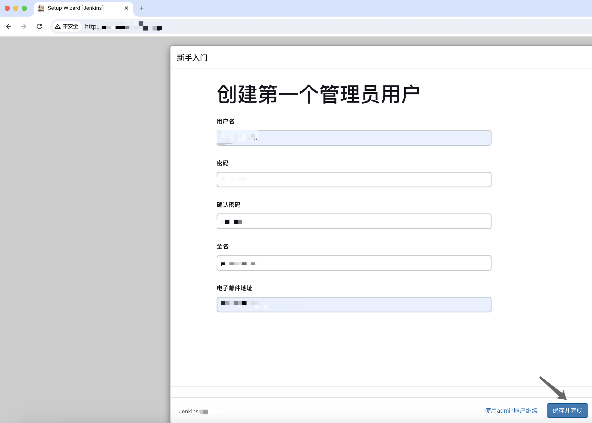
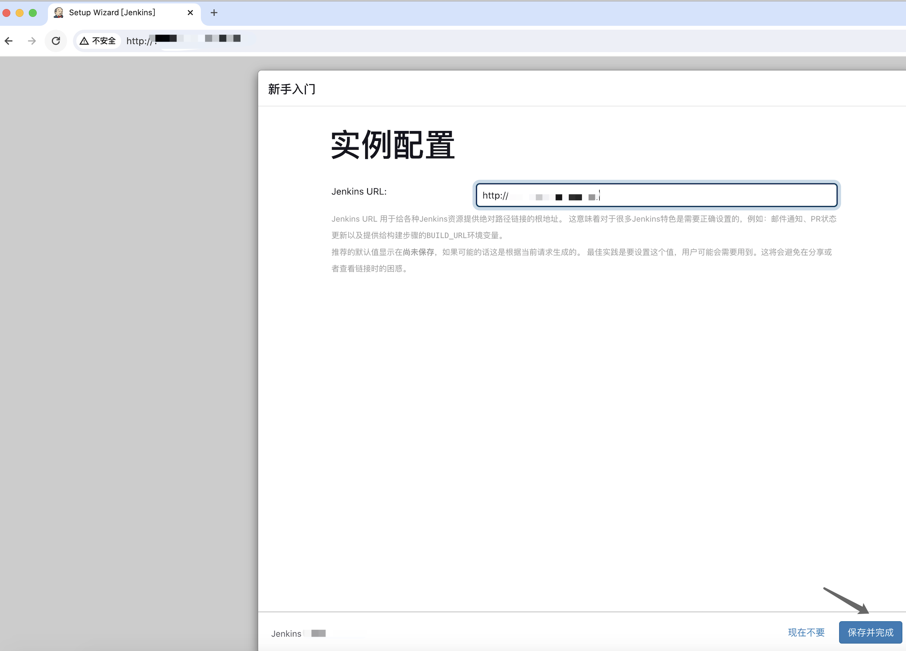
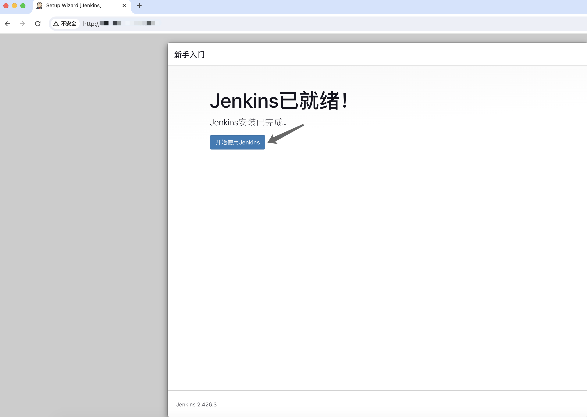
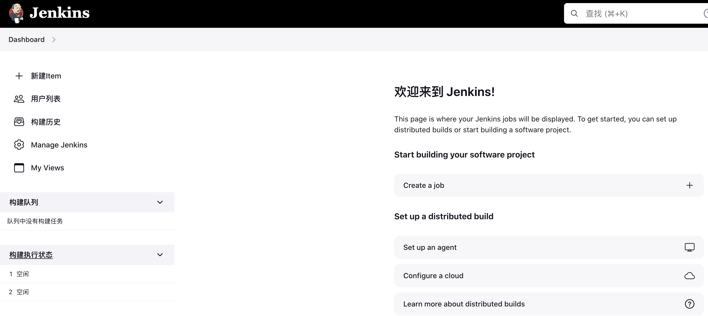
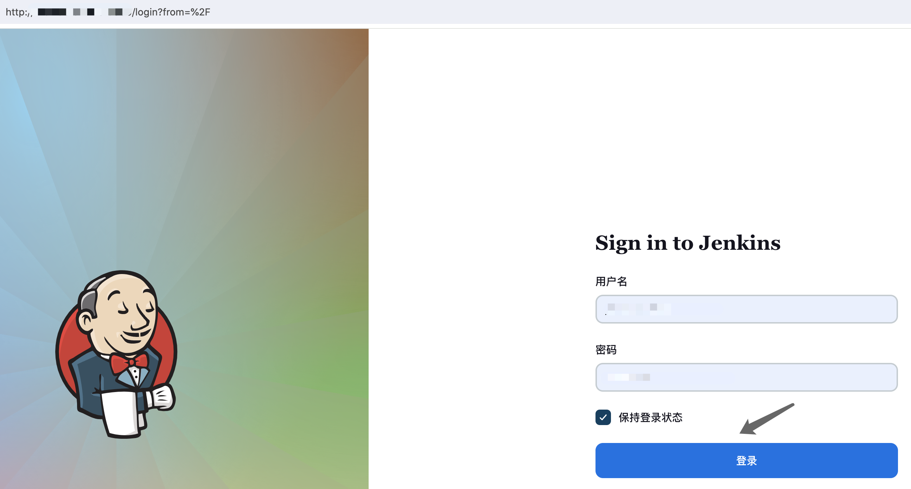
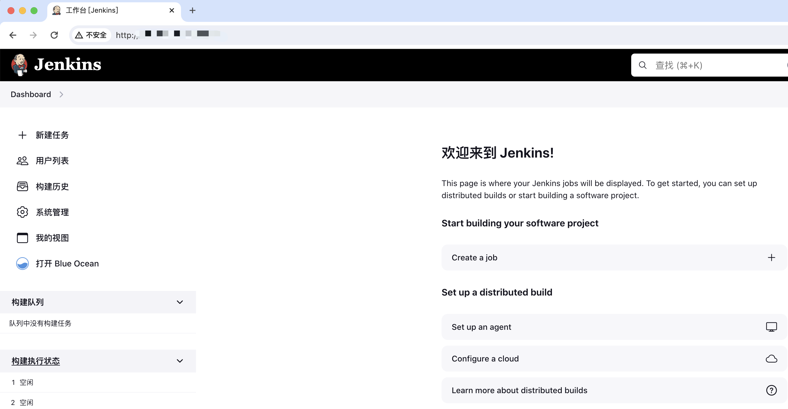

京东云部署部署jenkins

# 一：京东云主机部署jenkins：

下载地址：https://mirrors.tuna.tsinghua.edu.cn/jenkins/debian-stable/

JDK 版本依赖：https://www.jenkins.io/doc/book/platform-information/support-policy-java/

## 1.1：安装JDK：

```bash
root@20240123-instance:~# lsb_release  -a
No LSB modules are available.
Distributor ID: Ubuntu
Description:    Ubuntu 22.04.3 LTS
Release:        22.04
Codename:       jammy

root@20240123-instance:~# apt install openjdk-11-jdk

root@20240123-instance:~# java -version
openjdk version "11.0.22" 2024-01-16
OpenJDK Runtime Environment (build 11.0.22+7-post-Ubuntu-0ubuntu222.04.1)
OpenJDK 64-Bit Server VM (build 11.0.22+7-post-Ubuntu-0ubuntu222.04.1, mixed mode, sharing)
```

## 1.2：jenkins安装：

```bash
root@20240123-instance:~# cd /usr/local/src/
root@20240123-instance:/usr/local/src# wget https://mirrors.tuna.tsinghua.edu.cn/jenkins/debian-stable/jenkins_2.426.3_all.deb
root@20240123-instance:/usr/local/src# dpkg -i jenkins_2.426.3_all.deb 
root@20240123-instance:/usr/local/src# vim  /etc/default/jenkins  #可选自定义配置
# user and group to be invoked as (default to jenkins)
JENKINS_USER=root
JENKINS_GROUP=root

root@20240123-instance:/usr/local/src# vim /lib/systemd/system/jenkins.service
# Unix account that runs the Jenkins daemon
# Be careful when you change this, as you need to update the permissions of
# $JENKINS_HOME, $JENKINS_LOG, and (if you have already run Jenkins)
# $JENKINS_WEBROOT.
User=root
Group=root

root@20240123-instance:/usr/local/src# systemctl  daemon-reload
root@20240123-instance:/usr/local/src# systemctl  restart  jenkins.service 
```

## 1.3：jenkins初始化:

访问服务器地址的8080 端口，然后通过web初始化jenkins，如：http://116.198.52.178:8080/

### 1.3.1：解锁jenkins：

```bash
root@20240123-instance:/usr/local/src# cat /var/lib/jenkins/secrets/initialAdminPassword
ab24604161e84b3395e044f8c171682f
```



### 1.3.2：安装推荐插件：



### 1.3.3：安装过程中：



### 1.3.4：初始化账户信息：



### 1.3.5：确认实例配置：



### 1.3.6：开始使用jenkins：





### 1.3.7：安装常用插件：

Manage Jenkins--> Plugins -->Available plugins

```
    Blue Ocean  #强大的pipliine UI管理界面
    Git Parameter #获取git分之
    
root@20240123-instance:~# systemctl  restart  jenkins.service #插件安装完成后重启jenkins
```

### 1.3.8：重新登录jenkins:




