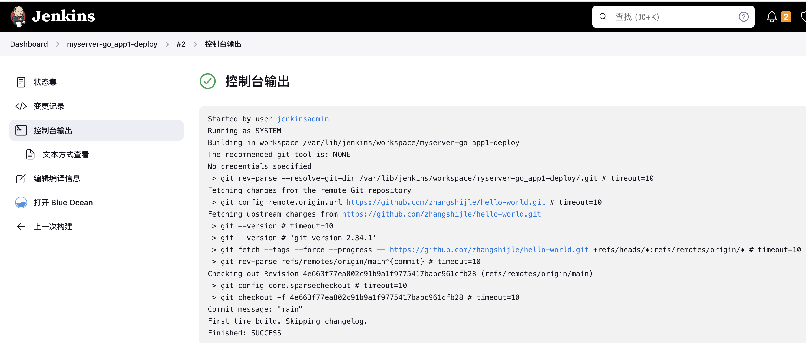

基于jenkins实现go语言代码部署和回滚

# 一：jenkins实现代码clone：


## 1.1：jenkins代码clone配置：


### 1.1.1：部署流程：


### 1.1.2：jenkins代码clone配置：

新建任务-->创建一个自由风格的软件项目：


### 1.1.3：测试代码clone：

#### 1.1.3.1：执行立即构建：


#### 1.1.3.2：查看控制台输出：


#### 1.1.3.3：验证任务执行过程：



## 1.2：分支选择配置：

在代码部署过程中可以自定义选择分支

### 1.2.1：配置任务：


### 1.2.2：添加选项参数：

#### 1.2.2.1:  选择参数配置：


#### 1.2.2.2：传递分支变量参数：


### 1.2.3：测试代码clone:


#### 1.2.3.1：目的分支选择：


#### 1.2.3.2：验证执行结果：


#### 1.2.3.3：验证代码内容：

```bash
root@20240123-instance:~# cat /var/lib/jenkins/workspace/myserver-go_app1-deploy/main.go 

/**
 * Copyright 2021 Google Inc.
 *
 * Licensed under the Apache License, Version 2.0 (the "License");
 * you may not use this file except in compliance with the License.
 * You may obtain a copy of the License at
 *
 *   http://www.apache.org/licenses/LICENSE-2.0
 *
 * Unless required by applicable law or agreed to in writing, software
 * distributed under the License is distributed on an "AS IS" BASIS,
 * WITHOUT WARRANTIES OR CONDITIONS OF ANY KIND, either express or implied.
 * See the License for the specific language governing permissions and
 * limitations under the License.
 */

// [START gke_hello_app]
// [START container_hello_app]
package main

import (
        "fmt"
        "log"
        "net/http"
        "os"
)

func main() {
        // register hello function to handle all requests
        mux := http.NewServeMux()
        mux.HandleFunc("/", hello)

        // use PORT environment variable, or default to 8080
        port := os.Getenv("PORT")
        if port == "" {
                port = "8080"
        }

        // start the web server on port and accept requests
        log.Printf("Server listening on port %s", port)
        log.Fatal(http.ListenAndServe(":"+port, mux))
}

// hello responds to the request with a plain-text "Hello, world" message.
func hello(w http.ResponseWriter, r *http.Request) {
        log.Printf("Serving request: %s", r.URL.Path)
        host, _ := os.Hostname()
        fmt.Fprintf(w, "Hello, world!\n")
        fmt.Fprintf(w, "Version: 1.0.1\n")
        fmt.Fprintf(w, "Hostname: %s\n", host)
}

// [END container_hello_app]
// [END gke_hello_app]
```

## 1.3：编写代码部署脚本：

基于shell脚本，实现代码的部署与回滚

### 1.3.1：脚本内容：

```bash
root@20240123-instance:~# mkdir  /data/scripts/myserver/app1
root@20240123-instance:~# cd /data/scripts/myserver/app1
root@20240123-instance:/data/scripts/myserver/app1# cat myserver_go-app1-deploy.sh 
#!/bin/bash

#记录脚本开始执行时间
starttime=`date +'%Y-%m-%d %H:%M:%S'`

#变量
CODE_DIR="/var/lib/jenkins/workspace/myserver-go_app1-deploy"
JOB_NAME="myserver-go_app1-deploy"
SHELL_DIR="/data/scripts/myserver/app1/"
SHELL_NAME="$0"
K8S_CONTROLLER1="127.0.0.1"
DATE=`date +%Y-%m-%d_%H_%M_%S`
METHOD=$1
#BRANCH=$2

#if test -z $Branch;then
#         Branch=develop
#fi

function Code_TAG(){
  Git_URL="github.com/zhangshijle/hello-world.git"
  DIR_NAME=`echo ${Git_URL} |awk -F "/" '{print $3}' | awk -F "." '{print $1}'`
  DATA_DIR="/var/lib/jenkins/workspace"
  Git_Dir="${CODE_DIR}"
  TAG=`cd ${Git_Dir} && git rev-parse --short HEAD`
  echo "分支TAG=$TAG"
}


#到控制端执行脚本制作并上传镜像
function Make_Image(){
  echo "开始制作Docker镜像并上传到镜像仓库" && sleep 1
  cd ${CODE_DIR} && bash build-command.sh ${TAG}-${DATE}
  echo "Docker镜像制作完成并已经上传到harbor服务器" && sleep 1
}


#到控制端更新k8s yaml文件中的镜像版本号,从而保持yaml文件中的镜像版本号和k8s中版本号一致
function Update_k8s_yaml(){
  echo "即将更新k8s yaml文件中镜像版本" && sleep 1
    ssh root@${K8S_CONTROLLER1} "cd ${CODE_DIR}/k8s/deploy && sed -i 's/image: myserver-cn-north-1.jcr.service.jdcloud.*/image: myserver-cn-north-1.jcr.service.jdcloud.com\/myserver\/hello-world:${TAG}-${DATE}/g' 1.hello-world-deployment.yaml"
  echo "k8s yaml文件镜像版本更新完成,即将开始更新容器中镜像版本" && sleep 1
}


#到控制端更新k8s中容器的版本号,有两种更新办法，一是指定镜像版本更新，二是apply执行修改过的yaml文件
function Update_k8s_container(){
  #第一种方法
  ssh root@${K8S_CONTROLLER1} "kubectl set image deployment/myserver-hello-world-deployment  myserver-hello-world-container=myserver-cn-north-1.jcr.service.jdcloud.com/myserver/hello-world:${TAG}-${DATE} -n myserver" 
  #第二种方法,推荐使用第一种
  #ssh root@${K8S_CONTROLLER1} "cd  ${SHELL_DIR}/yamls  && kubectl  apply -f llm_internal_deployment.yaml" 
  echo "k8s 镜像更新完成" && sleep 1
  echo "当前业务镜像版本: myserver-cn-north-1.jcr.service.jdcloud.com/myserver/hello-world:${TAG}-${DATE}"
  #计算脚本累计执行时间，如果不需要的话可以去掉下面四行
  endtime=`date +'%Y-%m-%d %H:%M:%S'`
root@20240123-instance:/data/scripts/myserver/app1# cat myserver_go-app1-deploy.sh 
#!/bin/bash

#记录脚本开始执行时间
starttime=`date +'%Y-%m-%d %H:%M:%S'`

#变量
CODE_DIR="/var/lib/jenkins/workspace/myserver-go_app1-deploy"
JOB_NAME="myserver-go_app1-deploy"
SHELL_DIR="/data/scripts/myserver/app1/"
SHELL_NAME="$0"
K8S_CONTROLLER1="127.0.0.1"
DATE=`date +%Y-%m-%d_%H_%M_%S`
METHOD=$1
#BRANCH=$2

#if test -z $Branch;then
#         Branch=develop
#fi

function Code_TAG(){
  Git_URL="github.com/zhangshijle/hello-world.git"
  DIR_NAME=`echo ${Git_URL} |awk -F "/" '{print $3}' | awk -F "." '{print $1}'`
  DATA_DIR="/var/lib/jenkins/workspace"
  Git_Dir="${CODE_DIR}"
  TAG=`cd ${Git_Dir} && git rev-parse --short HEAD`
  echo "分支TAG=$TAG"
}


#到控制端执行脚本制作并上传镜像
function Make_Image(){
  echo "开始制作Docker镜像并上传到镜像仓库" && sleep 1
  cd ${CODE_DIR} && bash build-command.sh ${TAG}-${DATE}
  echo "Docker镜像制作完成并已经上传到harbor服务器" && sleep 1
}


#到控制端更新k8s yaml文件中的镜像版本号,从而保持yaml文件中的镜像版本号和k8s中版本号一致
function Update_k8s_yaml(){
  echo "即将更新k8s yaml文件中镜像版本" && sleep 1
    ssh root@${K8S_CONTROLLER1} "cd ${CODE_DIR}/k8s/deploy && sed -i 's/image: myserver-cn-north-1.jcr.service.jdcloud.*/image: myserver-cn-north-1.jcr.service.jdcloud.com\/myserver\/hello-world:${TAG}-${DATE}/g' 1.hello-world-deployment.yaml"
  echo "k8s yaml文件镜像版本更新完成,即将开始更新容器中镜像版本" && sleep 1
}


#到控制端更新k8s中容器的版本号,有两种更新办法，一是指定镜像版本更新，二是apply执行修改过的yaml文件
function Update_k8s_container(){
  #第一种方法
  ssh root@${K8S_CONTROLLER1} "kubectl set image deployment/myserver-hello-world-deployment  myserver-hello-world-container=myserver-cn-north-1.jcr.service.jdcloud.com/myserver/hello-world:${TAG}-${DATE} -n myserver" 
  #第二种方法,推荐使用第一种
  #ssh root@${K8S_CONTROLLER1} "cd  ${SHELL_DIR}/yamls  && kubectl  apply -f llm_internal_deployment.yaml" 
  echo "k8s 镜像更新完成" && sleep 1
  echo "当前业务镜像版本: myserver-cn-north-1.jcr.service.jdcloud.com/myserver/hello-world:${TAG}-${DATE}"
  #计算脚本累计执行时间，如果不需要的话可以去掉下面四行
  endtime=`date +'%Y-%m-%d %H:%M:%S'`
  start_seconds=$(date --date="$starttime" +%s);
  end_seconds=$(date --date="$endtime" +%s);
  echo "本次业务镜像更新总计耗时："$((end_seconds-start_seconds))"s"
}

#基于k8s 内置版本管理回滚到上一个版本
function rollback_last_version(){
  echo "即将回滚至上一个版本"
  ssh root@${K8S_CONTROLLER1}  "kubectl rollout undo deployment/myserver-hello-world-deployment  -n myserver"
  sleep 1
  echo "已执行回滚至上一个版本"
}

#使用帮助
usage(){
  echo "部署使用方法为 ${SHELL_DIR}/${SHELL_NAME} deploy "
  echo "回滚到上一版本使用方法为 ${SHELL_DIR}/${SHELL_NAME} rollback_last_version"
}

main(){
  case ${METHOD}  in
  deploy)
    Code_TAG;
    Make_Image; 
    Update_k8s_yaml;
    Update_k8s_container;
  ;;
  rollback_last_version)
    rollback_last_version;
  ;;
  *)
    usage;
  esac;
}

main $1
```

### 1.3.2：测试部署功能：

```bash
root@20240123-instance:/data/scripts/myserver/app1# bash  myserver_go-app1-deploy.sh  deploy 

分支TAG=2bd68a9
开始制作Docker镜像并上传到镜像仓库
[+] Building 1.7s (13/13) FINISHED                                                                                                                docker:default
 => [internal] load build definition from Dockerfile                                                                                                        0.0s
 => => transferring dockerfile: 1.02kB                                                                                                                      0.0s
 => [internal] load metadata for docker.io/gcriodistroless/base-debian11:latest                                                                             1.4s
 => [internal] load metadata for docker.io/library/golang:1.21.0                                                                                            1.6s
 => [internal] load .dockerignore                                                                                                                           0.0s
 => => transferring context: 2B                                                                                                                             0.0s
 => [builder 1/5] FROM docker.io/library/golang:1.21.0@sha256:b490ae1f0ece153648dd3c5d25be59a63f966b5f9e1311245c947de4506981aa                              0.0s
 => [stage-1 1/3] FROM docker.io/gcriodistroless/base-debian11:latest@sha256:a94918eedfd2b1c7cdbb9ab51d1d937b6fda64692248913b20425094a79f0c22               0.0s
 => [internal] load build context                                                                                                                           0.0s
 => => transferring context: 29B                                                                                                                            0.0s
 => CACHED [builder 2/5] WORKDIR /app                                                                                                                       0.0s
 => CACHED [builder 3/5] RUN go mod init hello-app                                                                                                          0.0s
 => CACHED [builder 4/5] COPY *.go ./                                                                                                                       0.0s
 => CACHED [builder 5/5] RUN CGO_ENABLED=0 GOOS=linux go build -o /hello-app                                                                                0.0s
 => CACHED [stage-1 2/3] COPY --from=builder /hello-app /hello-app                                                                                          0.0s
 => exporting to image                                                                                                                                      0.0s
 => => exporting layers                                                                                                                                     0.0s
 => => writing image sha256:1b9a8f70a332709109c7dd238135fa2910fa97b8bb605d9ceadf1b85109d6852                                                                0.0s
 => => naming to myserver-cn-north-1.jcr.service.jdcloud.com/myserver/hello-world:2bd68a9-2024-03-28_16_20_29                                               0.0s
The push refers to repository [myserver-cn-north-1.jcr.service.jdcloud.com/myserver/hello-world]
a2d3a72a2e7f: Layer already exists 
c8beeff22ce7: Layer already exists 
714f56238fb5: Layer already exists 
2a8c0ba89665: Layer already exists 
2388d21e8e2b: Layer already exists 
c048279a7d9f: Layer already exists 
1a73b54f556b: Layer already exists 
2a92d6ac9e4f: Layer already exists 
bbb6cacb8c82: Layer already exists 
ac805962e479: Layer already exists 
af5aa97ebe6c: Layer already exists 
4d049f83d9cf: Layer already exists 
1df9699731f7: Layer already exists 
6fbdf253bbc2: Layer already exists 
70c35736547b: Layer already exists 
2bd68a9-2024-03-28_16_20_29: digest: sha256:b84ebc2b6e2c72bb4ee74291e52c8860b3672793bfff98aadef5482963f46342 size: 3445
Docker镜像制作完成并已经上传到harbor服务器
即将更新k8s yaml文件中镜像版本
k8s yaml文件镜像版本更新完成,即将开始更新容器中镜像版本
deployment.apps/myserver-hello-world-deployment image updated
k8s 镜像更新完成
当前业务镜像版本: myserver-cn-north-1.jcr.service.jdcloud.com/myserver/hello-world:2bd68a9-2024-03-28_16_20_29
本次业务镜像更新总计耗时：11s


root@20240123-instance:/data/scripts/myserver/app1# kubectl  get pod -n myserver #验证pod状态
NAME                                               READY   STATUS    RESTARTS   AGE
myserver-hello-world-deployment-86d6856f9f-vflmh   1/1     Running   0          23s
```

### 1.3.3：测试回滚功能：

```bash
root@20240123-instance:/data/scripts/myserver/app1# bash  myserver_go-app1-deploy.sh  rollback_last_version
即将回回滚至上一个版本
deployment.apps/myserver-hello-world-deployment rolled back
已执行回滚至上一个版本

root@20240123-instance:/data/scripts/myserver/app1#  kubectl  get pod -n myserver #验证pod状态
NAME                                               READY   STATUS    RESTARTS   AGE
myserver-hello-world-deployment-86d6856f9f-pc2rz   1/1     Running   0          16s
```

## 1.4：jenkins任务配置及构建：

在jenkins控制台配置执行任务

### 1.4.1：构建参数：

传递一个构建选项参数，部署还是回滚


### 1.4.2：构建配置：


### 1.4.3：执行构建：


### 1.4.4：构建结果：


## 1.6：验证web服务版本：

验证web服务是否 v3版本


